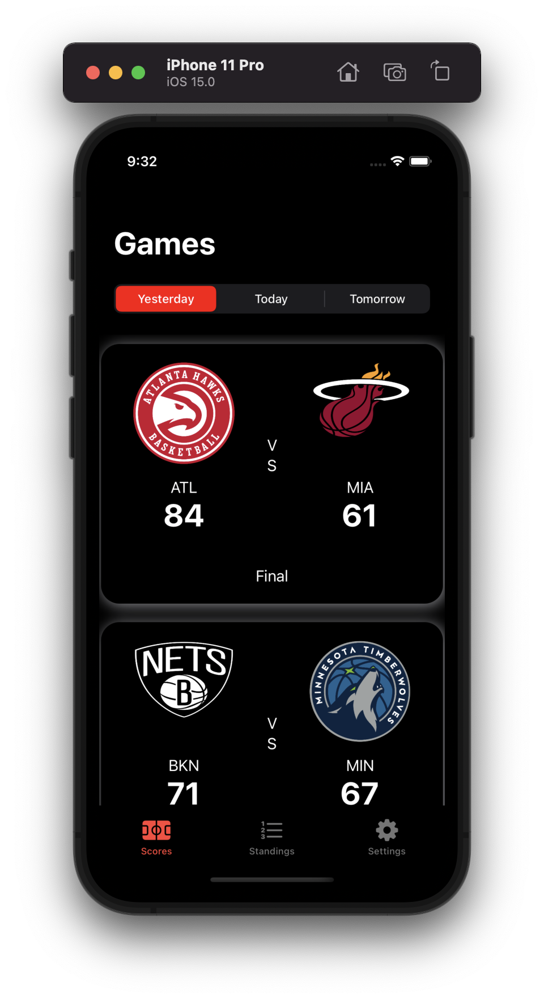
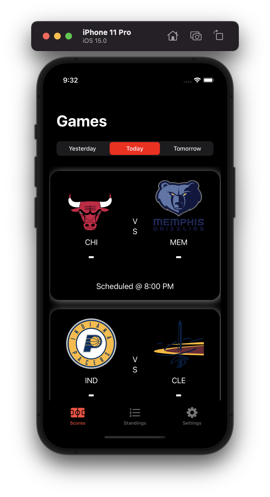
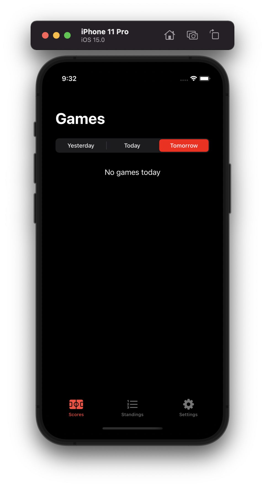
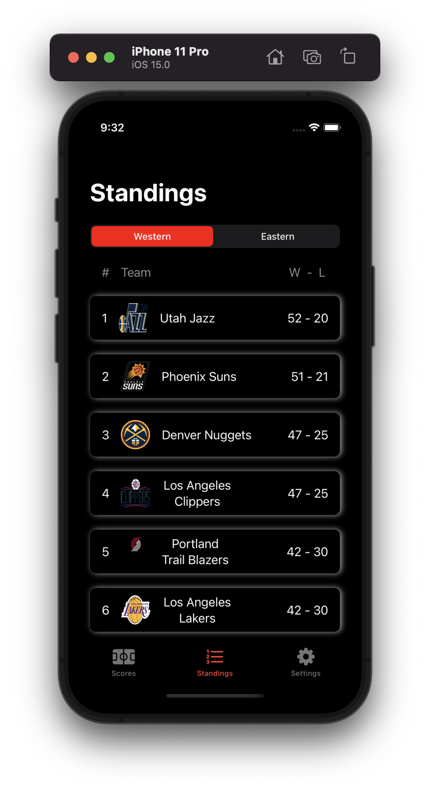
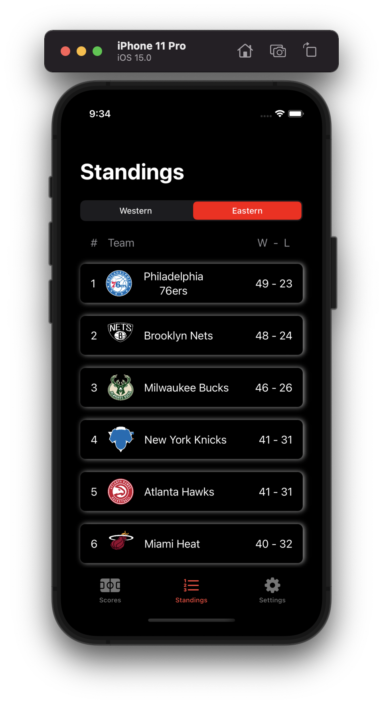
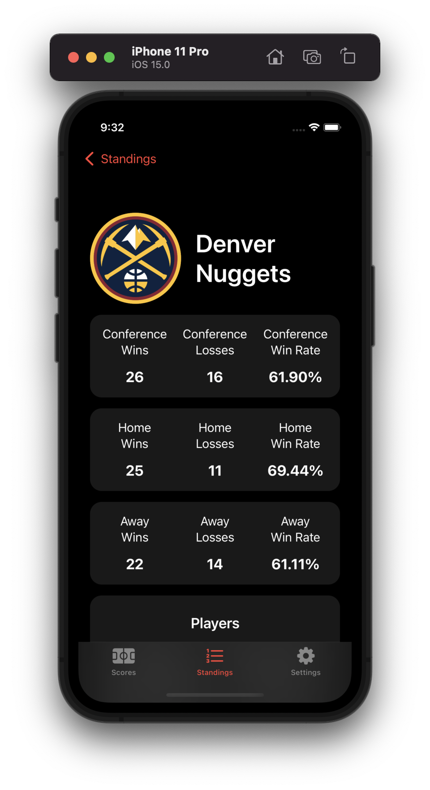
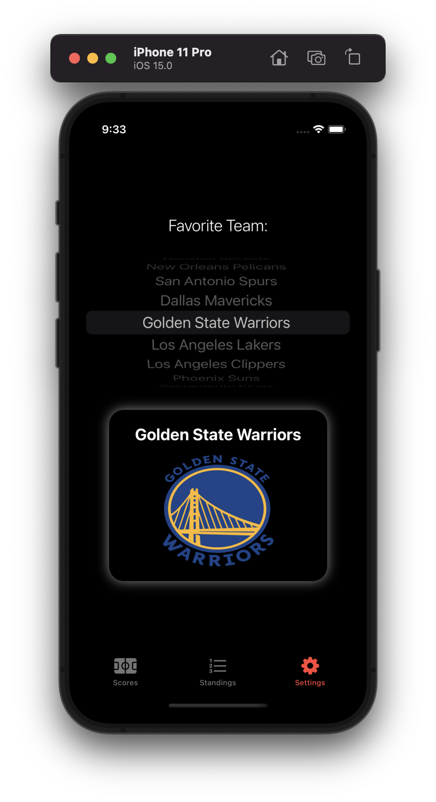
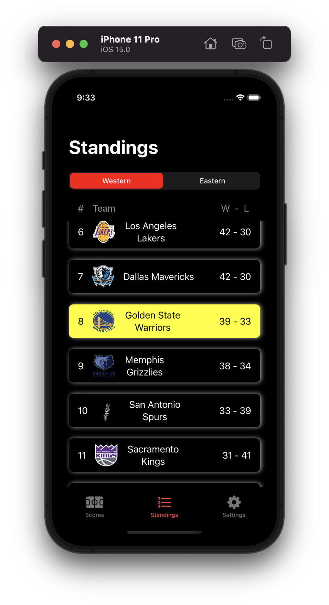

# NBA-Stats

NBA-Stats is an app that keeps track of and dislays NBA games & scores. 

## Who is this for?

This app is for anyone who loves Basketball and the NBA and wasn't to when the games play, what the scores are, and where their favorite team stands amongst the other teams.

## Features

- Display scheduled games for Today, Yesterday, and Tomorrow. 
- Displays standings for Eastern and Western conference’s.
- Tap on a standing cell and see that team's data.
- Select your favorite team (this will highlight your team on the standings list)
- Beautiful UI in Light & Dark mode.

## Installation 

No third party libraries or additional installation needed. Simply copy this command into your terminal

`https://github.com/Aldo10012/NBA-Stats.git`

## Usage
1. When you open the app, you will be presented with the scores tab, where you can select which day you want to view. You will see a list of games displaying the home and away team, when the game is scheduled, and the scores. 

  

2. By taping on the "standings" tab, you can see the standings for both the Western and Eastern Conference’s. (Standings means rank based on win/lose ratio). If you were to tap one of the teams, you will see the team's information.

  

3. You can select your favorite team in the "settings" tab. If you were to look back to the standings list, you will find that your favorite team has been highlighted gold.

        
